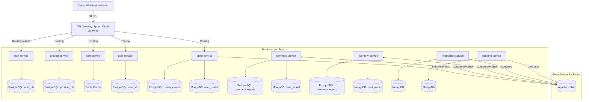
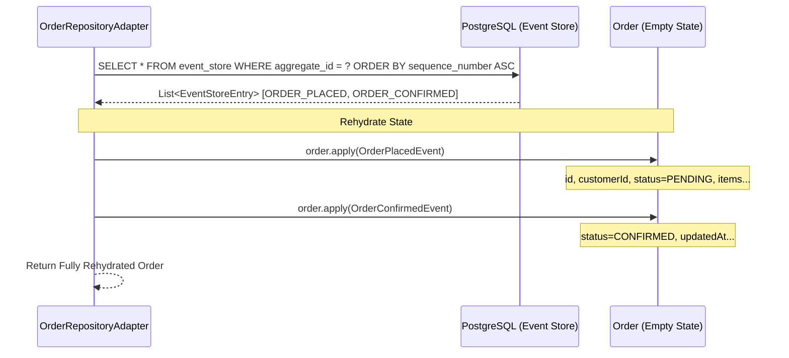
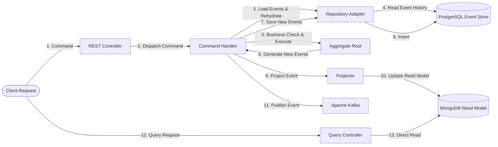
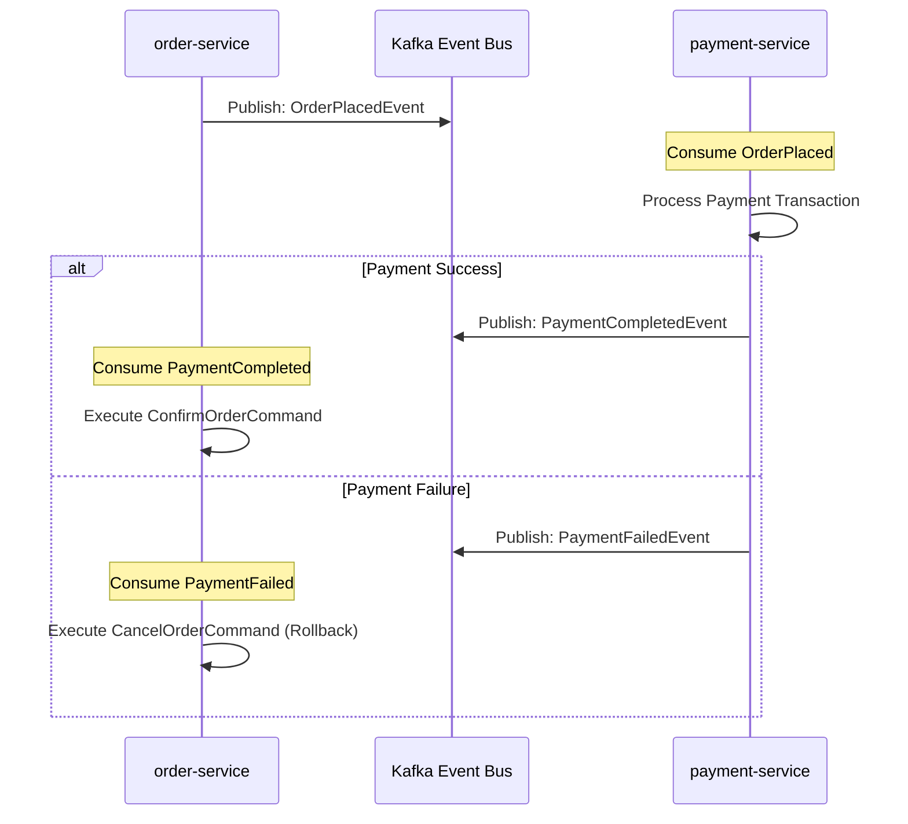

# Tài liệu Kiến trúc & Các Design Patterns trong Codebase

Tài liệu này cung cấp cái nhìn chi tiết về kiến trúc tổng quan, các mẫu thiết kế (design patterns), công cụ công nghệ được sử dụng trong codebase **shopping-microservices**, cũng như phân tích lợi ích và lý do lựa chọn của chúng.

---

## 1. Tổng quan Kiến trúc Hệ thống

Hệ thống được phát triển theo mô hình **Microservices** nằm trong một **Monorepo**. Mỗi dịch vụ (microservice) là một đơn vị độc lập cả về logic nghiệp vụ lẫn lưu trữ dữ liệu.


*Hình 1: Mô hình hóa các Microservices kết nối qua Kafka Event Bus (Ảnh minh họa)*

### Sơ đồ luồng hoạt động tổng thể


---

## 2. Các Architectural & Design Patterns Cốt Lõi

### 2.1. Domain-Driven Design (DDD)
Mỗi microservice được thiết kế như một **Bounded Context** độc lập. Logic nghiệp vụ cốt lõi nằm ở trung tâm và được bảo vệ khỏi sự ảnh hưởng của các framework bên ngoài.

*   **Aggregate Root**: Là điểm truy cập duy nhất để thay đổi trạng thái của một nhóm các đối tượng liên quan. Ví dụ: Lớp [Order](file:///c:/Workspace/Personal/Spring-Boot/Learn_DDD/claude-event-sourcing/services/order-service/src/main/java/com/example/order/domain/model/Order.java) kế thừa từ [AggregateRoot](file:///c:/Workspace/Personal/Spring-Boot/Learn_DDD/claude-event-sourcing/shared/common-domain/src/main/java/com/example/common/domain/AggregateRoot.java).
*   **Domain Events**: Các sự kiện đại diện cho một sự thật đã xảy ra trong quá khứ của Domain (ví dụ: `OrderPlacedEvent`, `OrderConfirmedEvent`). Các sự kiện này kế thừa từ interface [DomainEvent](file:///c:/Workspace/Personal/Spring-Boot/Learn_DDD/claude-event-sourcing/shared/common-domain/src/main/java/com/example/common/domain/DomainEvent.java).
*   **Value Objects**: Các đối tượng không có danh tính riêng, chỉ được định nghĩa bằng các thuộc tính của chúng (ví dụ: `Money`).

#### Cấu trúc thư mục Hexagonal (Ports & Adapters) bên trong mỗi service:
```
{service-name}/
└── src/main/java/com/example/{service}/
    ├── domain/               # CORE: Quy tắc nghiệp vụ thuần túy, độc lập với framework
    │   ├── model/            # Aggregate Roots, Entities, Value Objects
    │   ├── events/           # Domain Events
    │   └── repository/       # Interfaces định nghĩa các Port lưu trữ
    ├── application/          # USE CASES: Điều phối luồng nghiệp vụ
    │   ├── command/          # Command Handlers & Command DTOs
    │   └── query/            # Query Handlers & Read DTOs
    ├── infrastructure/       # ADAPTERS: Triển khai kỹ thuật (Spring, Kafka, JPA, MongoDB)
    │   ├── persistence/      # Event Store & Read Model Repositories
    │   ├── messaging/        # Kafka Publishers, Consumers & Projectors
    │   └── config/           # Cấu hình Spring Boot & Third-party
    └── interfaces/           # ENTRY POINTS: Điểm tiếp nhận yêu cầu (REST Controllers)
```

---

### 2.2. Event Sourcing (ES)
Thay vì lưu trữ trạng thái hiện tại của thực thể vào database (ví dụ: cột `status = 'CONFIRMED'`), **Event Sourcing** lưu trữ toàn bộ lịch sử các sự kiện thay đổi trạng thái dưới dạng một chuỗi append-only (chỉ ghi thêm).

*   **Cơ chế lưu trữ**: Được triển khai tại lớp [EventStoreEntry](file:///c:/Workspace/Personal/Spring-Boot/Learn_DDD/claude-event-sourcing/services/order-service/src/main/java/com/example/order/infrastructure/persistence/entity/EventStoreEntry.java) lưu vào bảng `event_store` trong PostgreSQL với định dạng JSONB chứa `payload` của event.
*   **Tái thiết trạng thái (Reconstitution/Rehydration)**: Khi cần lấy thông tin một Aggregate, hệ thống sẽ truy vấn toàn bộ các sự kiện của aggregate đó sắp xếp theo thứ tự thời gian (`sequenceNumber`) và chạy tuần tự phương thức `apply(event)` để khôi phục trạng thái mới nhất.
    *   Xem chi tiết cách hoạt động tại lớp [OrderRepositoryAdapter.findById](file:///c:/Workspace/Personal/Spring-Boot/Learn_DDD/claude-event-sourcing/services/order-service/src/main/java/com/example/order/infrastructure/persistence/adapter/OrderRepositoryAdapter.java#L51-L61).

#### Sơ đồ tái thiết Aggregate từ Event Store:


> [!NOTE]
> **Selective Event Sourcing (Áp dụng chọn lọc - ADR 0001):** Hệ thống chỉ áp dụng Event Sourcing cho 3 dịch vụ cốt lõi liên quan đến tiền tệ và hàng hóa là **Order**, **Payment**, và **Inventory**. Các dịch vụ còn lại (`product`, `user`, `cart`, `auth`) sử dụng mô hình lưu trữ trạng thái truyền thống (CRUD) để giảm tải độ phức tạp và chi phí vận hành.

---

### 2.3. CQRS (Command Query Responsibility Segregation)
CQRS thực hiện tách biệt hoàn toàn luồng ghi (Command - ghi vào Event Store) và luồng đọc (Query - đọc từ Read Model tối ưu hóa cho truy vấn).

*   **Write Side**: Tiếp nhận các lệnh làm thay đổi trạng thái thông qua Command Handlers (như [PlaceOrderHandler](file:///c:/Workspace/Personal/Spring-Boot/Learn_DDD/claude-event-sourcing/services/order-service/src/main/java/com/example/order/application/command/handler/PlaceOrderHandler.java)). Dữ liệu được ghi vào PostgreSQL Event Store.
*   **Projection**: Các sự kiện sau khi ghi thành công vào Event Store sẽ được truyền sang [OrderProjector](file:///c:/Workspace/Personal/Spring-Boot/Learn_DDD/claude-event-sourcing/services/order-service/src/main/java/com/example/order/infrastructure/messaging/projector/OrderProjector.java) để cập nhật đồng bộ (hoặc bất đồng bộ) sang MongoDB Read Model ([OrderDocument](file:///c:/Workspace/Personal/Spring-Boot/Learn_DDD/claude-event-sourcing/services/order-service/src/main/java/com/example/order/infrastructure/persistence/entity/OrderDocument.java)).
*   **Read Side**: Các API truy vấn danh sách hoặc chi tiết Order sẽ đọc trực tiếp từ MongoDB thông qua Spring Data MongoDB. Luồng này cực kỳ nhanh vì dữ liệu đã được denormalize sẵn, không cần joins phức tạp.

#### Sơ đồ luồng CQRS & Event Sourcing:


---

### 2.4. Event-Driven Architecture & Saga Choreography
Hệ thống sử dụng **Apache Kafka** làm xương sống để giao tiếp bất đồng bộ giữa các dịch vụ độc lập. Khi một quy trình nghiệp vụ kéo dài qua nhiều service (phân tán), hệ thống sử dụng **Saga Choreography** (Biên đạo Saga) để phối hợp các bước.

*   **Choreography**: Không có một service điều phối trung tâm. Thay vào đó, mỗi service tự lắng nghe (consume) các event liên quan từ Kafka và tự đưa ra quyết định hành động tiếp theo của mình.
*   **Ví dụ thực tế**:
    1. `order-service` phát hành sự kiện `OrderPlacedEvent`.
    2. `payment-service` lắng nghe event này, tiến hành trừ tiền và phát hành sự kiện `PaymentCompletedEvent` (hoặc `PaymentFailedEvent`).
    3. `order-service` lắng nghe `PaymentCompletedEvent` qua [PaymentEventConsumer](file:///c:/Workspace/Personal/Spring-Boot/Learn_DDD/claude-event-sourcing/services/order-service/src/main/java/com/example/order/infrastructure/messaging/consumer/PaymentEventConsumer.java) và kích hoạt [ConfirmOrderHandler](file:///c:/Workspace/Personal/Spring-Boot/Learn_DDD/claude-event-sourcing/services/order-service/src/main/java/com/example/order/application/command/handler/ConfirmOrderHandler.java) để xác nhận đơn hàng thành công. Nếu thanh toán thất bại, nó sẽ gọi [CancelOrderHandler](file:///c:/Workspace/Personal/Spring-Boot/Learn_DDD/claude-event-sourcing/services/order-service/src/main/java/com/example/order/application/command/handler/CancelOrderHandler.java).



---

### 2.5. Concurrency Pattern: Fan-out / Fan-in
Được triển khai trong quá trình xác nhận đơn hàng ([ConfirmOrderHandler.java](file:///c:/Workspace/Personal/Spring-Boot/Learn_DDD/claude-event-sourcing/services/order-service/src/main/java/com/example/order/application/command/handler/ConfirmOrderHandler.java#L58-L81)).

*   **Fan-out**: Khi cần kiểm tra chéo nhiều dịch vụ khác (Kiểm tra kho hàng, Kiểm tra tính hợp lệ của thanh toán, Xác thực địa chỉ giao hàng), hệ thống sử dụng `CompletableFuture.runAsync()` để kích hoạt song song 3 tác vụ kiểm tra này trên các luồng xử lý khác nhau.
*   **Fan-in**: Sử dụng `CompletableFuture.allOf(...).get(3, TimeUnit.SECONDS)` để đợi tất cả các tác vụ hoàn thành đồng thời áp đặt một thời gian chờ nghiêm ngặt (timeout 3 giây). Nếu quá 3 giây, toàn bộ tác vụ sẽ bị hủy bỏ (cancel) và ném ra ngoại lệ.
*   **Lợi ích**: Giúp tổng thời gian kiểm tra giảm từ mức cộng dồn $T = t_1 + t_2 + t_3$ xuống chỉ còn $T = \max(t_1, t_2, t_3)$, tối ưu hóa đáng kể thời gian phản hồi (latency).

---

## 3. Bản đồ Kiến trúc & Patterns áp dụng chi tiết cho từng Service

Để hình dung trực quan và định vị chính xác mã nguồn, dưới đây là bảng ánh xạ chi tiết các kiến trúc, patterns được áp dụng tại từng service cụ thể trong codebase:

| Tên Service / Thành phần | Kiến trúc / Patterns áp dụng | Cách áp dụng & Định vị trong code |
| :--- | :--- | :--- |
| **api-gateway** | • API Gateway Pattern<br>• Gateway Routing & Load Balancing<br>• JWT Authentication Filter | Triển khai tại `infrastructure/api-gateway/`. Định cấu hình các routes động trỏ đến các microservices thông qua Eureka. Lớp `GatewayFilter` thực hiện chặn bắt để xác thực chữ ký JWT token trước khi forward request đi sâu vào hệ thống. |
| **service-discovery** | • Service Registry & Discovery | Triển khai tại `infrastructure/service-discovery/`. Sử dụng **Netflix Eureka Server** làm nơi đăng ký IP/Port động cho tất cả các microservice. Các service khác khai báo annotation `@EnableDiscoveryClient` để tự động đăng ký. |
| **config-server** | • Centralized Configuration Store | Triển khai tại `infrastructure/config-server/`. Lưu trữ tập trung file thuộc tính `.yml` của tất cả các môi trường. Các microservices tải cấu hình từ server này lúc khởi động. |
| **order-service** | • Domain-Driven Design (DDD)<br>• Hexagonal Architecture<br>• Event Sourcing (ES)<br>• CQRS (PostgreSQL Write / MongoDB Read)<br>• Saga Choreography Consumer<br>• Fan-out / Fan-in Concurrency | • **DDD + Hexagonal:** Phân chia thư mục domain/application/infrastructure tại [order-service](file:///c:/Workspace/Personal/Spring-Boot/Learn_DDD/claude-event-sourcing/services/order-service/src/main/java/com/example/order/).<br>• **Event Sourcing:** Lớp [OrderRepositoryAdapter](file:///c:/Workspace/Personal/Spring-Boot/Learn_DDD/claude-event-sourcing/services/order-service/src/main/java/com/example/order/infrastructure/persistence/adapter/OrderRepositoryAdapter.java) thực hiện lưu chuỗi sự kiện vào `event_store` (PostgreSQL) và reconstitution trạng thái bằng cách chạy `apply(event)`.<br>• **CQRS:** [OrderProjector](file:///c:/Workspace/Personal/Spring-Boot/Learn_DDD/claude-event-sourcing/services/order-service/src/main/java/com/example/order/infrastructure/messaging/projector/OrderProjector.java) cập nhật đồng bộ sang MongoDB `OrderDocument` để phục vụ API Read.<br>• **Saga Consumer:** [PaymentEventConsumer](file:///c:/Workspace/Personal/Spring-Boot/Learn_DDD/claude-event-sourcing/services/order-service/src/main/java/com/example/order/infrastructure/messaging/consumer/PaymentEventConsumer.java) bắt event từ Kafka để kích hoạt lệnh xác nhận (`ConfirmOrderCommand`) hoặc hủy đơn (`CancelOrderCommand`).<br>• **Fan-out/in:** [ConfirmOrderHandler](file:///c:/Workspace/Personal/Spring-Boot/Learn_DDD/claude-event-sourcing/services/order-service/src/main/java/com/example/order/application/command/handler/ConfirmOrderHandler.java) kích hoạt song song 3 CompletableFuture để kiểm tra tồn kho, thanh toán và địa chỉ. |
| **payment-service** | • Domain-Driven Design (DDD)<br>• Event Sourcing (ES)<br>• CQRS (PostgreSQL Write / MongoDB Read)<br>• Saga Choreography Producer / Consumer | Triển khai tương tự cấu trúc của `order-service` tại `services/payment-service/`. Lắng nghe sự kiện `OrderPlacedEvent` từ topic `order-placed`, tiến hành xử lý thanh toán, lưu các sự kiện `PaymentCompletedEvent` / `PaymentFailedEvent` vào Event Store PostgreSQL, cập nhật Read Model MongoDB và đồng thời publish các sự kiện thanh toán lên Kafka để phối hợp Saga với `order-service`. |
| **inventory-service** | • Domain-Driven Design (DDD)<br>• Event Sourcing với Snapshotting | Triển khai tại `services/inventory-service/`. Ghi nhận mọi thay đổi xuất/nhập/giữ kho dưới dạng chuỗi sự kiện. Do tần suất thay đổi kho của một sản phẩm có thể lên tới hàng chục ngàn sự kiện, service này áp dụng thêm **Snapshot Pattern** để lưu trạng thái tổng hợp định kỳ (ví dụ: sau mỗi 100 sự kiện) giúp tăng tốc độ tái thiết trạng thái. |
| **auth-service** | • Relational State Persistence (CRUD)<br>• Token-based Security (JWT & OAuth2)<br>• Cache-Aside Pattern (Redis) | Triển khai tại `services/auth-service/`. Sử dụng PostgreSQL lưu thông tin người dùng và quyền truy cập (`auth_db`). Sử dụng **Redis** để quản lý danh sách token thu hồi (blacklist) và lưu trữ Refresh Token tạm thời phục vụ cơ chế xoay vòng token bảo mật. |
| **user-service** | • Relational State Persistence (CRUD)<br>• Cache-Aside Pattern (Redis) | Triển khai tại `services/user-service/`. Lưu trữ thông tin hồ sơ người dùng trong PostgreSQL (`user_db`). Sử dụng **Redis** làm tầng đệm bộ nhớ cache để trả về thông tin profile nhanh chóng khi các dịch vụ khác truy vấn chéo mà không cần đập trực tiếp vào database PostgreSQL. |
| **cart-service** | • Ephemeral Storage (Cache-Only Pattern) | Triển khai tại `services/cart-service/`. Không sử dụng SQL hay MongoDB. Thay vào đó, toàn bộ dữ liệu giỏ hàng (Shopping Cart) tạm thời của người dùng được lưu trực tiếp dưới dạng Hash map trong **Redis** với cấu hình TTL (Time-To-Live, ví dụ: tự xóa sau 24 giờ không tương tác) nhằm giảm thiểu tài nguyên và tối ưu tốc độ đọc/ghi giỏ hàng. |
| **notification-service** | • Event-Driven Consumer<br>• Traditional Document Store (CRUD) | Triển khai tại `services/notification-service/`. Lắng nghe hàng loạt các chủ đề (topics) từ Kafka (`order-placed`, `payment-failed`, v.v.). Khi nhận được sự kiện, nó thực thi gửi Email/SMS/Push notification và lưu lại log lịch sử vào MongoDB. |
| **shipping-service** | • Event-Driven Consumer<br>• Traditional Document Store (CRUD) | Triển khai tại `services/shipping-service/`. Lắng nghe sự kiện `OrderConfirmedEvent` từ topic `order-confirmed`, tiến hành tạo vận đơn vận chuyển tích hợp API với bên thứ 3 (GHN, GHTK, v.v.), lưu thông tin và trạng thái vận chuyển vào MongoDB. |

---

## 4. Lợi ích của việc áp dụng các Kiến trúc, Patterns và Công cụ

| Kiến trúc / Pattern / Công cụ | Lợi ích mang lại |
| :--- | :--- |
| **Domain-Driven Design (DDD)** | • Tách biệt hoàn toàn nghiệp vụ cốt lõi khỏi sự phụ thuộc vào công nghệ (database, framework).<br>• Ngôn ngữ chung (Ubiquitous Language) giúp lập trình viên và chuyên gia nghiệp vụ dễ dàng thống nhất logic.<br>• Phân chia ranh giới rõ ràng giúp code dễ bảo trì, dễ mở rộng khi dự án lớn lên. |
| **Event Sourcing (ES)** | • **Audit Trail hoàn hảo**: Lưu trữ mọi lịch sử thay đổi trạng thái, giúp việc đối soát tài chính, phát hiện lỗi hệ thống vô cùng dễ dàng.<br>• **Temporal Query (Truy vấn theo thời gian)**: Khả năng tái tạo trạng thái của toàn bộ hệ thống hoặc một thực thể tại bất kỳ thời điểm nào trong quá khứ.<br>• Tránh được xung đột ghi dữ liệu (no updates, only appends) giúp tối ưu hóa hiệu năng ghi. |
| **CQRS** | • **Tối ưu hóa hiệu năng**: Luồng ghi ghi thẳng vào PostgreSQL Event Store dạng append-only vô cùng nhanh. Luồng đọc đọc từ MongoDB chứa data đã denormalize sẵn, tránh join SQL giúp tăng tốc độ phản hồi API.<br>• **Mở rộng độc lập**: Có thể scale-out riêng số lượng pod xử lý lệnh đọc (Query) nếu ứng dụng có lượng người đọc lớn hơn ghi (thường là 90% đọc, 10% ghi). |
| **Database per Service** | • **Độc lập hoàn toàn**: Thay đổi schema của một service không làm ảnh hưởng đến các service khác.<br>• **Polyglot Persistence**: Cho phép lựa chọn cơ sở dữ liệu phù hợp nhất cho bài toán: PostgreSQL cho Event Store, MongoDB cho Read Model phẳng, Redis cho Cart tạm thời, MySQL cho quan hệ phụ trợ. |
| **Apache Kafka** | • **Decoupling (Khử liên kết)**: Các microservice không gọi trực tiếp lẫn nhau qua REST HTTP (làm tăng tính đồng phụ thuộc và dễ gây sập dây chuyền), thay vào đó giao tiếp qua Kafka giúp tăng tính chịu lỗi (fault-tolerance). Nếu một service bị sập, các service khác vẫn hoạt động bình thường và event sẽ được xử lý lại khi service đó khôi phục. |
| **Spring Cloud Gateway & Eureka** | • Cung cấp một cổng truy cập duy nhất cho Client, ẩn đi sự phức tạp của hạ tầng mạng microservices phía sau.<br>• Khả năng load balancing tự động và định tuyến linh hoạt dựa trên service registry (Eureka). |
| **Jaeger (Distributed Tracing)** | • **Truy vết phân tán**: Giúp nhà phát triển nhìn rõ đường đi của một request qua nhiều microservice khác nhau, từ đó dễ dàng phát hiện nút thắt cổ chai (bottleneck) về hiệu năng hoặc điểm phát sinh lỗi trong hệ thống phân tán. |
| **Prometheus & Grafana** | • Thu thập metrics hệ thống (CPU, Memory, JVM, Kafka lag, DB connections) và hiển thị trực quan dạng biểu đồ, giúp phát hiện sớm các bất thường và hỗ trợ đắc lực cho việc vận hành sản xuất. |

---

## 5. Phân tích Chuyên sâu: Tại sao chọn Pattern cho Service cụ thể?

Kiến trúc tốt không phải là áp dụng mọi công nghệ mới nhất vào toàn bộ hệ thống, mà là **áp dụng đúng mẫu thiết kế cho đúng bài toán**. Dưới đây là phân tích chi tiết tại sao các patterns được áp dụng chọn lọc trong codebase này:

### 5.1. Event Sourcing & CQRS: Chỉ dành cho Order, Payment, và Inventory
#### 1. Lý do áp dụng tại đây mà không phải chỗ khác:
*   **Giá trị nghiệp vụ (Business Criticality):** Đây là 3 dịch vụ liên quan trực tiếp đến dòng tiền, hàng hóa vật lý và nghĩa vụ pháp lý. Mọi lỗi xảy ra (ví dụ: mất tiền của khách, lệch tồn kho) đều gây thiệt hại tài chính lớn. Do đó, yêu cầu một **Audit Trail (dấu vết kiểm toán)** bất biến và tuyệt đối tin cậy là bắt buộc.
*   **Trạng thái phức tạp (Complex State Machine):**
    *   `Order` có vòng đời chuyển dịch phức tạp: *Đặt hàng → Kiểm tra kho → Xác thực thanh toán → Chờ giao hàng → Đang giao → Hoàn thành / Hoàn trả*.
    *   `Payment` cần theo vết các bước: *Khởi tạo → Ủy quyền (Authorize) → Thu tiền (Capture) → Hủy ủy quyền (Void) → Hoàn tiền (Refund)*.
    *   Việc lưu chuỗi sự kiện cho phép tái hiện hoặc quay ngược (Rollback/Compensating Transaction) trạng thái chính xác bất kỳ lúc nào nếu xảy ra sự cố trong Saga phân tán.
*   **Tần suất Đọc/Ghi lệch pha:** Đơn hàng và giao dịch thanh toán khi đã tạo xong thì chủ yếu là đọc trạng thái. CQRS cho phép đồng bộ dữ liệu sang MongoDB để tìm kiếm rất nhanh mà không làm nghẽn Event Store PostgreSQL dùng để ghi.

#### 2. Tại sao KHÔNG áp dụng cho Product, User, Cart?
*   `product-service` (danh mục sản phẩm) và `user-service` (thông tin người dùng) là các dịch vụ **CRUD thuần túy**. Tần suất ghi cực kỳ thấp (quản trị viên cập nhật thông tin) nhưng đọc cực kỳ cao. Nếu sử dụng Event Sourcing, chúng ta phải viết các Event Projector phức tạp chỉ để lưu một thay đổi đơn giản như đổi tên người dùng hoặc giá sản phẩm, gây lãng phí tài nguyên và tăng độ phức tạp vận hành mà không mang lại giá trị tương xứng.
*   `cart-service` (giỏ hàng) lưu trạng thái **tạm thời (ephemeral)**. Khách hàng thêm/xóa sản phẩm liên tục. Nếu lưu trữ lịch sử giỏ hàng bằng Event Sourcing, dung lượng database sẽ phình to rất nhanh với vô vàn sự kiện rác. Khi khách hàng thoát phiên hoặc mua hàng xong, giỏ hàng sẽ bị xóa. Do đó, lưu trực tiếp trên Redis Key-Value là tối ưu nhất.

#### 3. Ưu điểm & Nhược điểm:
*   **Ưu điểm:**
    *   Không bao giờ mất dữ liệu lịch sử (No data loss).
    *   Bảo vệ dữ liệu khỏi các tác vụ sửa đổi ngoài ý muốn (Immutable append-only log).
    *   CQRS tối ưu hóa hiệu năng đọc/ghi độc lập, cho phép scale-out read-model riêng lẻ.
    *   Hỗ trợ hoàn hảo để debug các lỗi nghiệp vụ phức tạp bằng cách chạy lại chuỗi sự kiện (Playback).
*   **Nhược điểm:**
    *   **Độ trễ đồng nhất (Eventual Consistency):** Dữ liệu cập nhật lên PostgreSQL sẽ mất một vài mili-giây để đồng bộ sang MongoDB. API đọc ngay lập tức có thể nhận dữ liệu cũ (Stale data).
    *   **Quản lý phiên bản (Event Versioning):** Khi cấu trúc event thay đổi (ví dụ thêm trường mới), cần viết code xử lý nâng cấp schema event (Upcasting) rất phức tạp.
    *   **Cognitive Load:** Yêu cầu lập trình viên phải hiểu rõ luồng đi bất đồng bộ, khó viết Unit Test hơn CRUD truyền thống.

---

### 5.2. Snapshot Pattern: Chỉ dành cho Inventory Service
#### 1. Lý do áp dụng tại đây mà không phải chỗ khác:
*   Một mặt hàng hot (ví dụ: iPhone mới mở bán) có thể phát sinh **hàng chục ngàn lượt thay đổi tồn kho** (giữ kho, trừ kho, hoàn kho) chỉ trong vài phút.
*   Nếu không có Snapshot, mỗi khi cần kiểm tra tồn kho hiện tại để xác nhận đơn hàng mới, hệ thống phải truy vấn và duyệt tuần tự qua 10.000+ sự kiện của sản phẩm đó để tính toán số dư. Hành động này sẽ gây nghẽn CPU và Database nghiêm trọng.
*   **Snapshotting** giải quyết việc này bằng cách lưu lại trạng thái tổng hợp (ví dụ: tồn kho = 150 tại Event thứ 5000). Khi khôi phục trạng thái, hệ thống chỉ cần đọc Snapshot này và áp dụng tiếp các sự kiện từ số 5001 trở đi.

#### 2. Tại sao KHÔNG áp dụng cho Order và Payment?
*   Một đơn hàng (`Order`) hoặc một giao dịch (`Payment`) từ lúc sinh ra đến lúc kết thúc chỉ có tối đa từ **5 đến 10 sự kiện** (Tạo → Xác nhận → Giao hàng → Thành công). 
*   Việc load và apply 5-10 sự kiện từ Postgres chỉ tốn chưa đầy 1 mili-giây, nên việc cài đặt thêm Snapshotting cho Order/Payment là hoàn toàn thừa thãi và làm phình to code không cần thiết.

#### 3. Ưu điểm & Nhược điểm:
*   **Ưu điểm:** Giới hạn số lượng sự kiện tối đa cần load lúc reconstitution trạng thái, giữ thời gian xử lý của dịch vụ ổn định ở mức hằng số $O(1)$ thay vì tăng tiến tuyến tính $O(N)$ theo thời gian.
*   **Nhược điểm:**
    *   Tăng thêm dung lượng lưu trữ cho các bản ghi Snapshot.
    *   Logic code phức tạp hơn: Lập trình viên phải điều phối việc lưu Snapshot định kỳ và xử lý lỗi khi Snapshot bị lỗi thời.

---

### 5.3. Cache-Aside vs. Ephemeral Store (Redis)
#### 1. Tại sao User/Auth dùng Cache-Aside còn Cart dùng Ephemeral Store?
*   **User & Auth (Cache-Aside):** Dữ liệu gốc nằm ở PostgreSQL (`user_db`, `auth_db`). Khi có request, API Gateway hoặc service kiểm tra Redis trước (cache hit). Nếu không có (cache miss), hệ thống truy vấn PostgreSQL rồi ghi ngược lại Redis. Dữ liệu này đọc rất nhiều nhưng ít ghi, do đó Cache-Aside giúp bảo vệ PostgreSQL khỏi quá tải.
*   **Cart (Ephemeral Cache-Only):** Dữ liệu giỏ hàng biến động liên tục từng giây (thêm, bớt, cập nhật số lượng). Nếu sử dụng DB quan hệ làm gốc và đồng bộ lên Redis qua Cache-Aside, số lượng kết nối và lệnh write xuống SQL DB sẽ cực kỳ lớn. Do đó, hệ thống chọn Redis làm **Database chính duy nhất (Ephemeral Store)** cho Cart với cấu hình tự hủy TTL 24h. Khi thanh toán thành công, đơn hàng mới được tạo bên `order-service` (lúc này dữ liệu mới chuyển thành chính thức bên PostgreSQL).

#### 2. Ưu điểm & Nhược điểm:
*   **Ưu điểm:** Tận dụng tối đa tốc độ đọc/ghi cực nhanh trên RAM của Redis (sub-millisecond latency), giảm chi phí phần cứng cơ sở dữ liệu SQL.
*   **Nhược điểm:** Nếu Redis bị sập đột ngột (không cấu hình Persistence), người dùng sẽ bị mất giỏ hàng tạm thời. Tuy nhiên, đây là sự đánh đổi chấp nhận được trong thương mại điện tử để đổi lấy trải nghiệm mượt mà và tốc độ tải trang tối đa.

