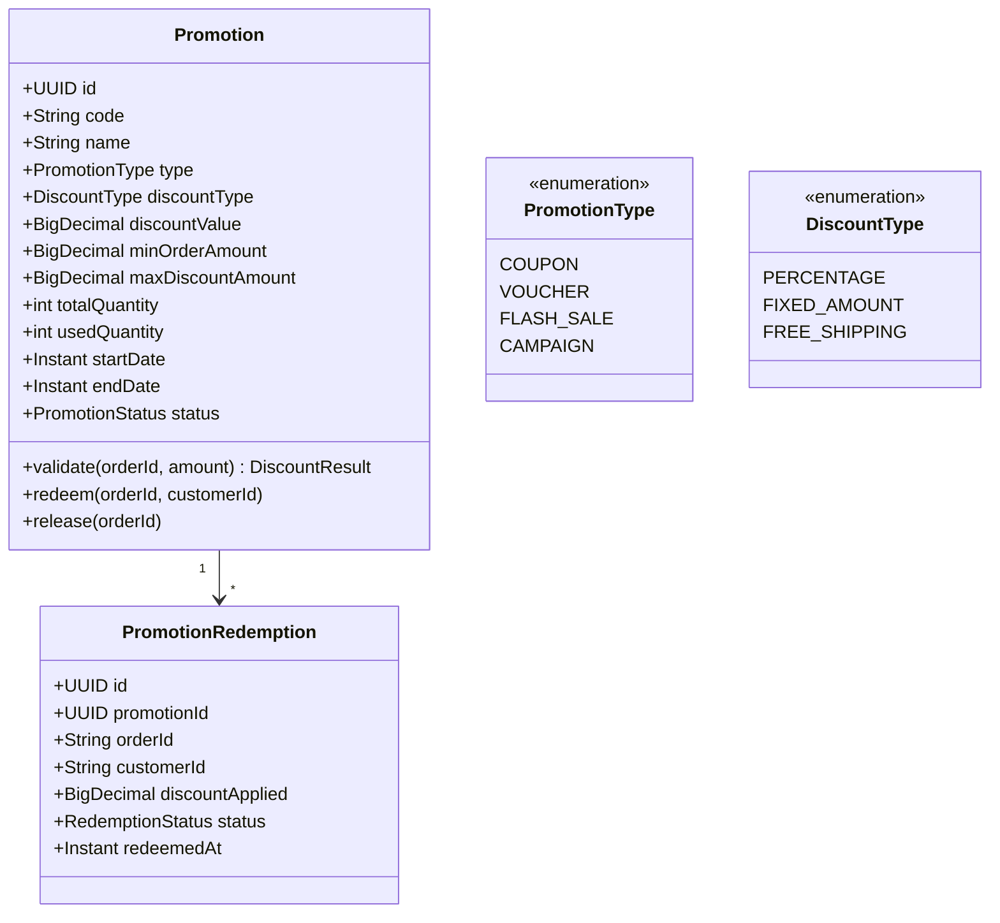
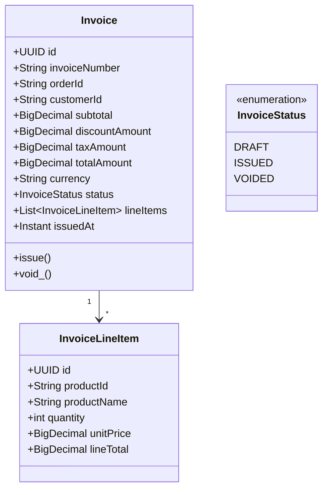
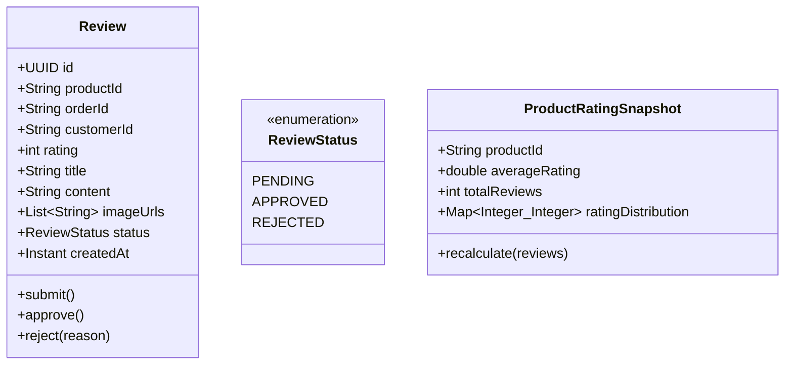

# Implementation Plan: Bổ Sung Services Cho E-Commerce Chuẩn Industry

## Mục tiêu

Bổ sung **3 services Tier-1** thiếu để hoàn thiện flow bán hàng e-commerce chuẩn production:

1. **`promotion-service`** — Khuyến mãi, coupon, voucher, flash sale
2. **`invoice-service`** — Hoá đơn điện tử (e-invoice)
3. **`review-service`** — Đánh giá sản phẩm, rating

Mỗi service sẽ follow **đúng patterns đã có**: DDD layered architecture, Kafka integration, Flyway migrations, Eureka discovery, Actuator + Prometheus metrics, OpenAPI docs.

---

## Tổng quan kiến trúc tích hợp

```mermaid
flowchart TB
    subgraph "Existing Flow"
        Cart["cart-service"]
        Order["order-service<br/>(Saga Orchestrator)"]
        Inv["inventory-service"]
        Pay["payment-service"]
        Ship["shipping-service"]
        Notif["notification-service"]
    end

    subgraph "New Services"
        Promo["promotion-service<br/>(NEW)"]
        Invoice["invoice-service<br/>(NEW)"]
        Review["review-service<br/>(NEW)"]
    end

    Cart -->|"checkout → HTTP"| Order
    Cart -.->|"validate coupon → HTTP"| Promo
    Order -->|"Saga: ReserveStock"| Inv
    Order -->|"Saga: ProcessPayment"| Pay
    Order -->|"Saga: ValidatePromotion (NEW)"| Promo
    Order -->|"OrderConfirmedEvent → Kafka"| Invoice
    Order -->|"OrderDeliveredEvent → Kafka"| Review
    Order -->|"OrderPlacedEvent → Kafka"| Notif
    Invoice -.->|"InvoiceIssuedEvent → Kafka"| Notif
end
```

---

## User Review Required

> [!IMPORTANT]
> **Saga Integration Decision**: Promotion validation có thể được xử lý theo 2 cách:
> - **Option A (Recommended)**: Validate promotion **synchronously via HTTP** trong `cart-service` hoặc `order-service` TRƯỚC khi bắt đầu saga. Đơn giản, nhanh, không cần thêm saga step.
> - **Option B**: Thêm saga step `VALIDATING_PROMOTION` giữa `RESERVING_STOCK` và `PROCESSING_PAYMENT`. Phức tạp hơn nhưng consistent với saga pattern.
>
> Plan này implement **Option A** (synchronous validation trước saga). Nếu bạn muốn Option B, hãy cho tôi biết.

> [!WARNING]
> **Database strategy**: `promotion-service` và `review-service` sẽ dùng **PostgreSQL CRUD** (giống product-service) vì không cần Event Sourcing. `invoice-service` cũng dùng PostgreSQL CRUD vì hoá đơn là immutable records — không cần replay events.

## Open Questions

1. **Promotion-service**: Có cần hỗ trợ flash sale (giới hạn số lượng voucher theo thời gian) không? Plan hiện tại đã include.
2. **Invoice-service**: Có cần tích hợp với provider hoá đơn điện tử thật (VNPT, Viettel, MISA) không? Hay chỉ cần internal invoice generation?
3. **Review-service**: Có cần moderation flow (admin duyệt review trước khi hiển thị) không?

---

## Phase 1: `promotion-service` (Khuyến mãi / Coupon)

### Domain Model



### Proposed Changes

#### Root Config

##### [MODIFY] [pom.xml](file:///c:/Workspace/Personal/Spring-Boot/Learn_DDD/claude-event-sourcing/pom.xml)
- Add `<module>services/promotion-service</module>` to modules list

##### [MODIFY] [docker-compose.yml](file:///c:/Workspace/Personal/Spring-Boot/Learn_DDD/claude-event-sourcing/docker/docker-compose.yml)
- Add `promotion-service` container (port 8090, PostgreSQL)

##### [MODIFY] [docker-compose.infra.yml](file:///c:/Workspace/Personal/Spring-Boot/Learn_DDD/claude-event-sourcing/docker/docker-compose.infra.yml)
- Add `postgres-promotion` database container

##### [MODIFY] [application.yml (gateway)](file:///c:/Workspace/Personal/Spring-Boot/Learn_DDD/claude-event-sourcing/infrastructure/api-gateway/src/main/resources/application.yml)
- Add route: `/api/promotions/**` → `lb://promotion-service` with `AuthenticationFilter`

##### [MODIFY] [prometheus.yml](file:///c:/Workspace/Personal/Spring-Boot/Learn_DDD/claude-event-sourcing/docker/prometheus/prometheus.yml)
- Add `host.docker.internal:8090` to scrape targets

---

#### Promotion Service — Domain Layer

##### [NEW] `services/promotion-service/pom.xml`
- Dependencies: `spring-boot-starter-web`, `spring-boot-starter-data-jpa`, `spring-boot-starter-validation`, `postgresql`, `flyway`, `common-security`, `common-events`, `common-domain`, `spring-kafka`, `eureka-client`, `springdoc-openapi`

##### [NEW] `services/promotion-service/src/main/java/com/example/promotion/domain/model/Promotion.java`
- Aggregate root with rich business logic:
  - `validate(orderAmount)` → checks date range, status, quantity remaining, min order amount
  - `redeem(orderId, customerId)` → decrements `usedQuantity`, creates `PromotionRedemption`
  - `release(orderId)` → compensates: increments `usedQuantity` back, marks redemption as RELEASED
  - `calculateDiscount(orderAmount)` → returns effective discount (capped by `maxDiscountAmount`)

##### [NEW] `services/promotion-service/src/main/java/com/example/promotion/domain/model/PromotionRedemption.java`
- Entity tracking: who used which promotion, for which order, how much discount

##### [NEW] `services/promotion-service/src/main/java/com/example/promotion/domain/model/PromotionType.java`
- Enum: `COUPON`, `VOUCHER`, `FLASH_SALE`, `CAMPAIGN`

##### [NEW] `services/promotion-service/src/main/java/com/example/promotion/domain/model/DiscountType.java`
- Enum: `PERCENTAGE`, `FIXED_AMOUNT`, `FREE_SHIPPING`

##### [NEW] `services/promotion-service/src/main/java/com/example/promotion/domain/model/PromotionStatus.java`
- Enum: `DRAFT`, `ACTIVE`, `PAUSED`, `EXPIRED`, `EXHAUSTED`

##### [NEW] `services/promotion-service/src/main/java/com/example/promotion/domain/model/RedemptionStatus.java`
- Enum: `APPLIED`, `RELEASED`, `CONFIRMED`

##### [NEW] `services/promotion-service/src/main/java/com/example/promotion/domain/repository/PromotionRepository.java`
- Domain port: `findByCode()`, `findById()`, `findActiveByCode()`

##### [NEW] `services/promotion-service/src/main/java/com/example/promotion/domain/repository/RedemptionRepository.java`
- Domain port: `findByOrderId()`, `findByCustomerIdAndPromotionId()`

---

#### Promotion Service — Application Layer

##### [NEW] `.../application/command/dto/ValidatePromotionCommand.java`
- Fields: `code`, `orderId`, `customerId`, `orderAmount`, `currency`

##### [NEW] `.../application/command/dto/RedeemPromotionCommand.java`
- Fields: `code`, `orderId`, `customerId`, `orderAmount`

##### [NEW] `.../application/command/dto/ReleasePromotionCommand.java`
- Fields: `orderId` (releases all promotions for this order — saga compensation)

##### [NEW] `.../application/command/handler/ValidatePromotionHandler.java`
- Validates coupon code → returns `DiscountResult(valid, discountAmount, reason)`
- Idempotent: same orderId + code returns same result

##### [NEW] `.../application/command/handler/RedeemPromotionHandler.java`
- `@Transactional`: Locks promotion row (`SELECT ... FOR UPDATE`), checks remaining qty, creates redemption
- Publishes `PromotionRedeemedEvent` to Kafka

##### [NEW] `.../application/command/handler/ReleasePromotionHandler.java`
- Compensation handler for saga rollback
- Marks redemption as RELEASED, increments `usedQuantity`

##### [NEW] `.../application/query/handler/PromotionQueryHandler.java`
- List active promotions, search by code, get redemption history

##### [NEW] `.../application/query/dto/PromotionResponse.java`
##### [NEW] `.../application/query/dto/DiscountResult.java`

---

#### Promotion Service — Infrastructure Layer

##### [NEW] `.../infrastructure/persistence/repository/JpaPromotionRepository.java`
- Spring Data JPA extending domain port

##### [NEW] `.../infrastructure/persistence/repository/JpaRedemptionRepository.java`

##### [NEW] `.../infrastructure/messaging/consumer/OrderEventConsumer.java`
- Listens to `OrderCancelledEvent` → auto-release all promotions for that order
- Listens to `OrderConfirmedEvent` → confirm redemption status

##### [NEW] `.../infrastructure/messaging/publisher/PromotionEventPublisher.java`
- Publishes `PromotionRedeemedEvent`, `PromotionReleasedEvent`

##### [NEW] `.../infrastructure/config/KafkaConfig.java`
- Kafka consumer/producer config with trusted packages

---

#### Promotion Service — Interface Layer

##### [NEW] `.../interfaces/rest/PromotionController.java`
```
POST   /api/promotions                    → create (ADMIN)
GET    /api/promotions                    → list active
GET    /api/promotions/{id}               → get by ID
GET    /api/promotions/code/{code}        → get by code
POST   /api/promotions/validate           → validate coupon for order
POST   /api/promotions/redeem             → redeem coupon
DELETE /api/promotions/{id}               → deactivate (ADMIN)
```

##### [NEW] `.../interfaces/rest/PromotionAdminController.java`
```
GET    /api/admin/promotions              → list all (including inactive)
POST   /api/admin/promotions/flash-sale   → create flash sale
GET    /api/admin/promotions/{id}/stats   → redemption statistics
```

##### [NEW] `.../interfaces/exception/GlobalExceptionHandler.java`

---

#### Promotion Service — Database & Config

##### [NEW] `.../resources/application.yml`
- Port: 8090
- PostgreSQL: `postgres-promotion:5432/promotion_db`
- Kafka consumer group: `promotion-service`

##### [NEW] `.../resources/db/migration/V1__create_promotion_schema.sql`
```sql
CREATE TABLE promotions (
    id                 UUID PRIMARY KEY DEFAULT gen_random_uuid(),
    code               VARCHAR(50) UNIQUE NOT NULL,
    name               VARCHAR(255) NOT NULL,
    description        TEXT,
    promotion_type     VARCHAR(20) NOT NULL,  -- COUPON, VOUCHER, FLASH_SALE
    discount_type      VARCHAR(20) NOT NULL,  -- PERCENTAGE, FIXED_AMOUNT, FREE_SHIPPING
    discount_value     NUMERIC(15,2) NOT NULL,
    min_order_amount   NUMERIC(15,2) DEFAULT 0,
    max_discount_amount NUMERIC(15,2),
    total_quantity     INT NOT NULL,
    used_quantity      INT NOT NULL DEFAULT 0,
    max_per_customer   INT DEFAULT 1,
    start_date         TIMESTAMPTZ NOT NULL,
    end_date           TIMESTAMPTZ NOT NULL,
    status             VARCHAR(20) NOT NULL DEFAULT 'ACTIVE',
    created_at         TIMESTAMPTZ NOT NULL DEFAULT NOW(),
    updated_at         TIMESTAMPTZ NOT NULL DEFAULT NOW()
);

CREATE TABLE promotion_redemptions (
    id                UUID PRIMARY KEY DEFAULT gen_random_uuid(),
    promotion_id      UUID NOT NULL REFERENCES promotions(id),
    order_id          VARCHAR(36) NOT NULL,
    customer_id       VARCHAR(36) NOT NULL,
    discount_applied  NUMERIC(15,2) NOT NULL,
    status            VARCHAR(20) NOT NULL DEFAULT 'APPLIED',
    redeemed_at       TIMESTAMPTZ NOT NULL DEFAULT NOW(),
    released_at       TIMESTAMPTZ,
    confirmed_at      TIMESTAMPTZ
);

CREATE INDEX idx_promo_code ON promotions (code);
CREATE INDEX idx_promo_status ON promotions (status, start_date, end_date);
CREATE INDEX idx_redemption_order ON promotion_redemptions (order_id);
CREATE INDEX idx_redemption_customer ON promotion_redemptions (customer_id, promotion_id);
```

##### [NEW] `.../resources/db/migration/V2__seed_promotions.sql`
- Sample promotions: `WELCOME10` (10% off), `FREESHIP` (free shipping), `FLASH50K` (50K off flash sale)

##### [NEW] `services/promotion-service/Dockerfile`

---

#### Kafka Events (common-events)

##### [MODIFY] [KafkaTopics.java](file:///c:/Workspace/Personal/Spring-Boot/Learn_DDD/claude-event-sourcing/shared/common-events/src/main/java/com/example/common/events/KafkaTopics.java)
- Add:
```java
// Promotion topics
public static final String PROMOTION_REDEEMED = "promotion.promotion.redeemed";
public static final String PROMOTION_RELEASED = "promotion.promotion.released";

// Invoice topics
public static final String INVOICE_ISSUED   = "invoice.invoice.issued";
public static final String INVOICE_VOIDED   = "invoice.invoice.voided";

// Review topics
public static final String REVIEW_SUBMITTED = "review.review.submitted";
public static final String REVIEW_APPROVED  = "review.review.approved";
```

##### [NEW] `shared/common-events/src/main/java/com/example/common/events/promotion/PromotionRedeemedEvent.java`
##### [NEW] `shared/common-events/src/main/java/com/example/common/events/promotion/PromotionReleasedEvent.java`
##### [NEW] `shared/common-events/src/main/java/com/example/common/events/invoice/InvoiceIssuedEvent.java`
##### [NEW] `shared/common-events/src/main/java/com/example/common/events/review/ReviewSubmittedEvent.java`

---

#### Order Service Integration

##### [MODIFY] [OrderPlacedEvent.java](file:///c:/Workspace/Personal/Spring-Boot/Learn_DDD/claude-event-sourcing/shared/common-events/src/main/java/com/example/common/events/order/OrderPlacedEvent.java)
- Add fields: `promotionCode`, `discountAmount` (optional, for orders with promotions)

##### [MODIFY] [PlaceOrderHandler.java](file:///c:/Workspace/Personal/Spring-Boot/Learn_DDD/claude-event-sourcing/services/order-service/src/main/java/com/example/order/application/command/handler/PlaceOrderHandler.java)
- Before saga start: call `promotion-service` (via HTTP/Feign) to validate + redeem coupon
- If validation fails → reject order immediately (no saga needed)
- Pass `discountAmount` into `OrderSagaData`

##### [MODIFY] [OrderSagaOrchestrator.java](file:///c:/Workspace/Personal/Spring-Boot/Learn_DDD/claude-event-sourcing/services/order-service/src/main/java/com/example/order/application/saga/OrderSagaOrchestrator.java)
- In compensation flow: call `promotion-service` to release redeemed promotion
- Add `RELEASING_PROMOTION` compensation step after stock release

---

## Phase 2: `invoice-service` (Hoá đơn điện tử)

### Domain Model



### Proposed Changes

#### Root Config
##### [MODIFY] [pom.xml](file:///c:/Workspace/Personal/Spring-Boot/Learn_DDD/claude-event-sourcing/pom.xml) — Add module
##### [MODIFY] [docker-compose.yml](file:///c:/Workspace/Personal/Spring-Boot/Learn_DDD/claude-event-sourcing/docker/docker-compose.yml) — Add container (port 8091)
##### [MODIFY] [application.yml (gateway)](file:///c:/Workspace/Personal/Spring-Boot/Learn_DDD/claude-event-sourcing/infrastructure/api-gateway/src/main/resources/application.yml) — Add route `/api/invoices/**`
##### [MODIFY] [prometheus.yml](file:///c:/Workspace/Personal/Spring-Boot/Learn_DDD/claude-event-sourcing/docker/prometheus/prometheus.yml) — Add scrape target

---

#### Invoice Service — Domain Layer

##### [NEW] `.../domain/model/Invoice.java`
- Immutable after issued. `issue()` validates all line items, calculates tax (VAT 8%), sets `invoiceNumber` with format `INV-YYYYMMDD-XXXXX`
- `void_()` — only allowed within 24h of issuance (Vietnamese tax law constraint)

##### [NEW] `.../domain/model/InvoiceLineItem.java`
##### [NEW] `.../domain/model/InvoiceStatus.java`
##### [NEW] `.../domain/repository/InvoiceRepository.java`
##### [NEW] `.../domain/service/InvoiceNumberGenerator.java`
- Generates sequential invoice numbers per day: `INV-20260701-00001`
- Uses DB sequence for thread-safe number generation

---

#### Invoice Service — Application Layer

##### [NEW] `.../application/command/handler/IssueInvoiceHandler.java`
- `@Transactional`: Creates invoice from order data, generates invoice number, issues
- Idempotent by `orderId` — returns existing invoice if already issued

##### [NEW] `.../application/command/handler/VoidInvoiceHandler.java`
- Voids an invoice (with reason) — publishes `InvoiceVoidedEvent`

##### [NEW] `.../application/query/handler/InvoiceQueryHandler.java`
- Query by orderId, customerId, date range, invoice number
- Export as PDF (optional — can use JasperReports or iText)

---

#### Invoice Service — Infrastructure Layer

##### [NEW] `.../infrastructure/messaging/consumer/OrderEventConsumer.java`
- **Listens to `OrderConfirmedEvent`** → auto-issue invoice
  - Extracts order items, customer info, amounts from event payload
  - Creates + issues invoice
  - Publishes `InvoiceIssuedEvent` → notification-service sends invoice email

##### [NEW] `.../infrastructure/messaging/consumer/OrderCancellationConsumer.java`
- **Listens to `OrderCancelledEvent`** → auto-void invoice (if exists)

---

#### Invoice Service — Interface Layer

##### [NEW] `.../interfaces/rest/InvoiceController.java`
```
GET    /api/invoices/{id}                → get by ID
GET    /api/invoices/order/{orderId}     → get by order
GET    /api/invoices/number/{number}     → get by invoice number
GET    /api/invoices/customer/{id}       → customer's invoices (paginated)
POST   /api/invoices/{id}/void           → void invoice (ADMIN)
GET    /api/invoices/{id}/pdf            → download PDF
```

---

#### Invoice Service — Database

##### [NEW] `.../resources/db/migration/V1__create_invoice_schema.sql`
```sql
CREATE TABLE invoices (
    id               UUID PRIMARY KEY DEFAULT gen_random_uuid(),
    invoice_number   VARCHAR(30) UNIQUE NOT NULL,
    order_id         VARCHAR(36) UNIQUE NOT NULL,
    customer_id      VARCHAR(36) NOT NULL,
    customer_name    VARCHAR(255),
    customer_email   VARCHAR(255),
    subtotal         NUMERIC(15,2) NOT NULL,
    discount_amount  NUMERIC(15,2) DEFAULT 0,
    tax_rate         NUMERIC(5,4) NOT NULL DEFAULT 0.08,
    tax_amount       NUMERIC(15,2) NOT NULL,
    total_amount     NUMERIC(15,2) NOT NULL,
    currency         VARCHAR(3) NOT NULL DEFAULT 'VND',
    status           VARCHAR(20) NOT NULL DEFAULT 'ISSUED',
    void_reason      TEXT,
    issued_at        TIMESTAMPTZ NOT NULL DEFAULT NOW(),
    voided_at        TIMESTAMPTZ,
    created_at       TIMESTAMPTZ NOT NULL DEFAULT NOW()
);

CREATE TABLE invoice_line_items (
    id            UUID PRIMARY KEY DEFAULT gen_random_uuid(),
    invoice_id    UUID NOT NULL REFERENCES invoices(id),
    product_id    VARCHAR(36) NOT NULL,
    product_name  VARCHAR(255) NOT NULL,
    sku           VARCHAR(50),
    quantity      INT NOT NULL,
    unit_price    NUMERIC(15,2) NOT NULL,
    line_total    NUMERIC(15,2) NOT NULL
);

CREATE SEQUENCE invoice_daily_seq START 1;

CREATE INDEX idx_invoice_order ON invoices (order_id);
CREATE INDEX idx_invoice_customer ON invoices (customer_id);
CREATE INDEX idx_invoice_issued ON invoices (issued_at);
CREATE INDEX idx_invoice_number ON invoices (invoice_number);
```

##### [NEW] `.../resources/application.yml` — Port 8091, PostgreSQL, Kafka consumer
##### [NEW] `services/invoice-service/Dockerfile`

---

## Phase 3: `review-service` (Đánh giá sản phẩm)

### Domain Model



### Proposed Changes

#### Root Config
##### [MODIFY] [pom.xml](file:///c:/Workspace/Personal/Spring-Boot/Learn_DDD/claude-event-sourcing/pom.xml) — Add module
##### [MODIFY] [docker-compose.yml](file:///c:/Workspace/Personal/Spring-Boot/Learn_DDD/claude-event-sourcing/docker/docker-compose.yml) — Add container (port 8092)
##### [MODIFY] [application.yml (gateway)](file:///c:/Workspace/Personal/Spring-Boot/Learn_DDD/claude-event-sourcing/infrastructure/api-gateway/src/main/resources/application.yml) — Add route `/api/reviews/**`

---

#### Review Service — Domain Layer

##### [NEW] `.../domain/model/Review.java`
- Business rules:
  - Rating 1-5 only
  - Can only review if order status is `DELIVERED`
  - One review per product per order (unique constraint: `orderId + productId`)
  - Content min 10 chars, max 2000 chars

##### [NEW] `.../domain/model/ReviewStatus.java`
##### [NEW] `.../domain/model/ProductRatingSnapshot.java`
- Denormalized read model: avg rating, total reviews, distribution {1: 5, 2: 3, 3: 10, 4: 25, 5: 57}

##### [NEW] `.../domain/repository/ReviewRepository.java`
##### [NEW] `.../domain/repository/ProductRatingRepository.java`

---

#### Review Service — Application Layer

##### [NEW] `.../application/command/handler/SubmitReviewHandler.java`
- `@Transactional`: Validates order delivered (via Kafka event tracking or HTTP to order-service), creates review
- Updates `ProductRatingSnapshot` (recalculates average)
- Publishes `ReviewSubmittedEvent`

##### [NEW] `.../application/command/handler/ModerateReviewHandler.java`
- Approve/reject review (admin only)

##### [NEW] `.../application/query/handler/ReviewQueryHandler.java`
- Get reviews by productId (paginated, sorted by date/rating)
- Get product rating snapshot
- Get customer's reviews

---

#### Review Service — Infrastructure Layer

##### [NEW] `.../infrastructure/messaging/consumer/OrderEventConsumer.java`
- Listens to `OrderDeliveredEvent` → enables review for this order's products
- Stores `order_delivery_record(orderId, customerId, productIds, deliveredAt)`

##### [NEW] `.../infrastructure/persistence/entity/OrderDeliveryRecord.java`
- Tracks which orders have been delivered — used to validate review eligibility

---

#### Review Service — Interface Layer

##### [NEW] `.../interfaces/rest/ReviewController.java`
```
POST   /api/reviews                           → submit review
GET    /api/reviews/product/{productId}        → reviews for product (paginated)
GET    /api/reviews/product/{productId}/rating → rating snapshot
GET    /api/reviews/customer/{customerId}      → customer's reviews
GET    /api/reviews/{id}                       → single review
```

##### [NEW] `.../interfaces/rest/ReviewAdminController.java`
```
GET    /api/admin/reviews/pending              → pending reviews
POST   /api/admin/reviews/{id}/approve         → approve
POST   /api/admin/reviews/{id}/reject          → reject
```

---

#### Review Service — Database

##### [NEW] `.../resources/db/migration/V1__create_review_schema.sql`
```sql
CREATE TABLE reviews (
    id            UUID PRIMARY KEY DEFAULT gen_random_uuid(),
    product_id    VARCHAR(36) NOT NULL,
    order_id      VARCHAR(36) NOT NULL,
    customer_id   VARCHAR(36) NOT NULL,
    rating        SMALLINT NOT NULL CHECK (rating BETWEEN 1 AND 5),
    title         VARCHAR(255),
    content       TEXT NOT NULL,
    image_urls    JSONB DEFAULT '[]',
    status        VARCHAR(20) NOT NULL DEFAULT 'PENDING',
    reject_reason TEXT,
    created_at    TIMESTAMPTZ NOT NULL DEFAULT NOW(),
    updated_at    TIMESTAMPTZ NOT NULL DEFAULT NOW(),
    UNIQUE (order_id, product_id)
);

CREATE TABLE product_rating_snapshots (
    product_id          VARCHAR(36) PRIMARY KEY,
    average_rating      NUMERIC(3,2) NOT NULL DEFAULT 0,
    total_reviews       INT NOT NULL DEFAULT 0,
    rating_1            INT NOT NULL DEFAULT 0,
    rating_2            INT NOT NULL DEFAULT 0,
    rating_3            INT NOT NULL DEFAULT 0,
    rating_4            INT NOT NULL DEFAULT 0,
    rating_5            INT NOT NULL DEFAULT 0,
    updated_at          TIMESTAMPTZ NOT NULL DEFAULT NOW()
);

CREATE TABLE order_delivery_records (
    id            UUID PRIMARY KEY DEFAULT gen_random_uuid(),
    order_id      VARCHAR(36) UNIQUE NOT NULL,
    customer_id   VARCHAR(36) NOT NULL,
    product_ids   JSONB NOT NULL,
    delivered_at  TIMESTAMPTZ NOT NULL
);

CREATE INDEX idx_review_product ON reviews (product_id, status);
CREATE INDEX idx_review_customer ON reviews (customer_id);
CREATE INDEX idx_review_status ON reviews (status);
CREATE INDEX idx_delivery_customer ON order_delivery_records (customer_id);
```

##### [NEW] `.../resources/application.yml` — Port 8092, PostgreSQL, Kafka consumer
##### [NEW] `services/review-service/Dockerfile`

---

## Phase 4: Cross-cutting Changes

### Notification Service Integration

##### [MODIFY] notification-service `OrderEventConsumer.java`
- Add handler for `InvoiceIssuedEvent` → send invoice email to customer
- Add handler for `ReviewSubmittedEvent` → notify seller of new review (optional)

### Cart Service Integration

##### [MODIFY] [CartCheckoutService.java](file:///c:/Workspace/Personal/Spring-Boot/Learn_DDD/claude-event-sourcing/services/cart-service/src/main/java/com/example/cart/application/service/CartCheckoutService.java)
- Add optional `promotionCode` to checkout request
- Call `promotion-service` to validate coupon before calling order-service
- Pass `promotionCode` + `discountAmount` to order-service

### Kubernetes

##### [NEW] `k8s/base/promotion-service.yaml`
##### [NEW] `k8s/base/invoice-service.yaml`
##### [NEW] `k8s/base/review-service.yaml`
##### [MODIFY] `k8s/base/kustomization.yaml` — Add new resources

---

## File Count Summary

| Phase | New Files | Modified Files |
|---|---|---|
| Phase 1: promotion-service | ~25 | 5 |
| Phase 2: invoice-service | ~20 | 3 |
| Phase 3: review-service | ~22 | 3 |
| Phase 4: Cross-cutting | 3 | 5 |
| **Total** | **~70** | **~16** |

---

## Execution Order

```
1. common-events  → Add new event classes + Kafka topics (dependency for all)
2. promotion-service → Full implementation (independent, no saga dependency)
3. order-service  → Integrate promotion validation into PlaceOrderHandler
4. cart-service   → Add coupon support to checkout
5. invoice-service → Full implementation (listens to OrderConfirmedEvent)
6. review-service → Full implementation (listens to OrderDeliveredEvent)
7. notification-service → Add handlers for new events
8. Docker/K8s/Config → Update all infrastructure configs
```

---

## Verification Plan

### Automated Tests
- **Domain tests**: Unit tests for `Promotion.validate()`, `Promotion.redeem()`, `Invoice.issue()`, `Review.submit()` — state transitions and validation rules
- **Handler tests**: Mockito tests for each command handler
- **Integration tests**: Testcontainers for PostgreSQL + Kafka
- **Build**: `mvn clean verify -pl services/promotion-service,services/invoice-service,services/review-service`

### Manual Verification
1. Start all services via `docker compose up -d`
2. Create a promotion → Checkout cart with coupon → Verify discount applied in order
3. Confirm order → Verify invoice auto-issued → Verify notification sent
4. Ship + deliver order → Submit review → Verify rating snapshot updated
5. Cancel order → Verify promotion released + invoice voided
