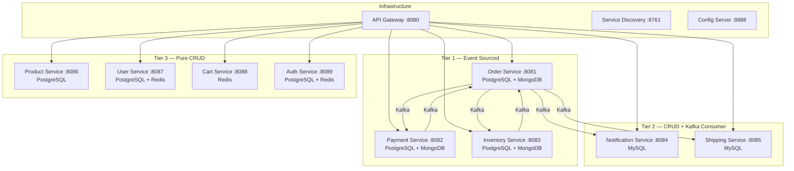
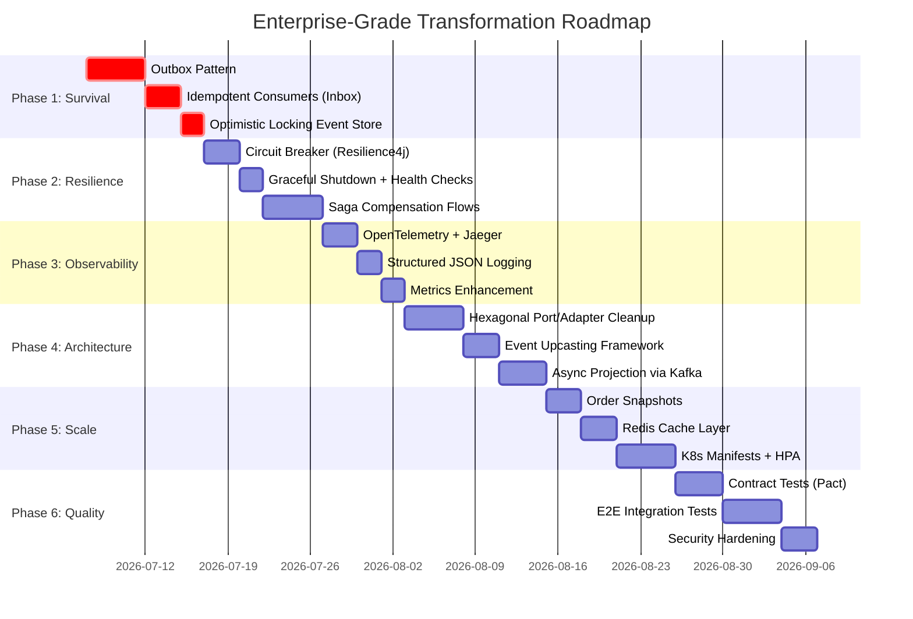

# 🏗️ Enterprise Architecture Audit — Shopping Microservices

> **Auditor**: Principal Software Architect Perspective
> **Codebase**: `claude-event-sourcing` (9 services + 3 infrastructure + 4 shared libs)
> **Stack**: Java 25, Spring Boot 4.1.0, Spring Cloud 2025.1.2, CQRS + Event Sourcing + Kafka

---

## 📊 Tổng Quan Hệ Thống



**Kết quả Audit**: Tìm thấy **47 vấn đề** trên 10 danh mục. Phân loại:
- 🔴 **Critical** (12) — Production blocker, data loss risk
- 🟡 **High** (18) — Sẽ gây sự cố ở scale medium
- 🟢 **Medium** (17) — Technical debt, nên fix trước khi scale

---

## 1. 🔴 Critical — Distributed Systems Issues

### 1.1 Không có Outbox Pattern — Dual-Write Problem

> [!CAUTION]
> **Đây là lỗi nghiêm trọng nhất trong toàn bộ codebase.**

**Vấn đề**: Trong [PlaceOrderHandler](file:///c:/Workspace/Personal/Spring-Boot/Learn_DDD/claude-event-sourcing/services/order-service/src/main/java/com/example/order/application/command/handler/PlaceOrderHandler.java#L44-L53):

```java
// 1. Persist to Event Store (source of truth)
orderRepository.save(order);              // ← DB commit

// 2. Update Read Model (MongoDB)
events.stream()...forEach(orderProjector::on);  // ← Có thể fail

// 3. Publish to Kafka (after persist — never before)
kafkaPublisher.publishAll(...);           // ← Có thể fail
```

**Hậu quả**: Nếu step 1 thành công nhưng step 3 fail (Kafka down, network partition), event sẽ bị **mất vĩnh viễn**. Các downstream services (payment, inventory, shipping) sẽ **không bao giờ** nhận được event → order bị treo ở trạng thái PENDING mãi mãi.

**Trade-off Analysis**:
| Giải pháp | Complexity | Reliability | Latency |
|---|---|---|---|
| **Outbox Pattern** (recommended) | Medium | 99.99%+ | +5-10ms |
| **CDC (Debezium)** | High | 99.999% | +50-100ms |
| **Transaction Log Tailing** | Very High | 99.999% | +10-30ms |

**Khuyến nghị**: Implement Outbox Pattern — write events vào `outbox` table trong CÙNG transaction với event store, sau đó một poller/CDC đọc outbox → publish to Kafka.

---

### 1.2 Kafka Consumer Không Idempotent — At-Least-Once Delivery

**Vấn đề**: [PaymentEventConsumer](file:///c:/Workspace/Personal/Spring-Boot/Learn_DDD/claude-event-sourcing/services/order-service/src/main/java/com/example/order/infrastructure/messaging/consumer/PaymentEventConsumer.java#L30-L38) catch exception rồi log, KHÔNG retry, KHÔNG dedup:

```java
@KafkaListener(topics = KafkaTopics.PAYMENT_COMPLETED, groupId = "order-service")
public void onPaymentCompleted(PaymentCompletedEvent event) {
    try {
        confirmOrderHandler.handle(...);  // ← Nếu Kafka redeliver, order confirm 2 lần?
    } catch (Exception e) {
        log.error(...);  // ← Swallow exception, event mất luôn
    }
}
```

**Hậu quả**: 
- Kafka redeliver (at-least-once) → double processing → order confirm 2 lần, payment charge 2 lần
- Exception bị swallow → message consumed successfully dù business logic fail → **data loss**

**Khuyến nghị**: Inbox Pattern + Idempotency Key (eventId + aggregateId).

---

### 1.3 Không có Saga State Machine — Choreography without Compensation

**Vấn đề**: Saga hiện tại dùng **choreography** (order ← kafka → payment → kafka → order) nhưng **KHÔNG có compensation flow hoàn chỉnh**.

Ví dụ: Order đã placed → Inventory reserved → Payment failed → CancelOrder handler chạy... nhưng **ai release inventory stock?**

Hiện tại: Không có consumer nào listen `ORDER_CANCELLED` để trigger `inventory.release()`.

```
ORDER_PLACED → INVENTORY_RESERVED → PAYMENT_FAILED
                     ↑ Stock locked forever!
```

---

### 1.4 Không có Optimistic Locking trên Event Store

**Vấn đề**: [OrderRepositoryAdapter.save()](file:///c:/Workspace/Personal/Spring-Boot/Learn_DDD/claude-event-sourcing/services/order-service/src/main/java/com/example/order/infrastructure/persistence/adapter/OrderRepositoryAdapter.java#L29-L47) dùng `countByAggregateId()` để tính `sequenceNumber`, nhưng **không check expected version**:

```java
long currentCount = eventStoreRepo.countByAggregateId(order.getId().toString());
// Race condition: 2 concurrent requests cùng đọc count=5
// → cả 2 write sequenceNumber=6 → unique constraint violation (may lose event)
```

Unique constraint sẽ reject 1 request, nhưng error handling chỉ throw `RuntimeException` — KHÔNG retry.

**Khuyến nghị**: Implement optimistic concurrency via `expectedVersion` parameter. Nếu version mismatch → retry hoặc return 409 Conflict.

---

## 2. 🔴 Security Concerns

### 2.1 JWT Secret Hardcoded trong application.yml

**Vấn đề**: [api-gateway/application.yml](file:///c:/Workspace/Personal/Spring-Boot/Learn_DDD/claude-event-sourcing/infrastructure/api-gateway/src/main/resources/application.yml#L72):
```yaml
security:
  jwt:
    secret: change-me-in-prod-this-is-a-long-demo-secret-key-256bits-minimum-len
```

Dù dùng env var fallback, default value VẪN bị commit vào Git → nếu deploy mà quên set env → production dùng key demo.

### 2.2 Database Credentials Plaintext

**Vấn đề**: Toàn bộ [docker-compose.infra.yml](file:///c:/Workspace/Personal/Spring-Boot/Learn_DDD/claude-event-sourcing/docker/docker-compose.infra.yml#L6-L8) dùng `POSTGRES_PASSWORD: secret`.

### 2.3 MongoDB Không Có Authentication

```yaml
uri: mongodb://${MONGODB_HOST:localhost}:${MONGODB_PORT:27017}/order_readmodel
```
→ Không user/password. Production sẽ bị truy cập trái phép.

---

## 3. 🟡 DDD Violations

### 3.1 Domain Layer Import Infrastructure Events

**Vấn đề**: [Order.java](file:///c:/Workspace/Personal/Spring-Boot/Learn_DDD/claude-event-sourcing/services/order-service/src/main/java/com/example/order/domain/model/Order.java#L5) import `com.example.common.events.order.*`:

```java
import com.example.common.events.order.*;  // ← shared module = infrastructure concern
```

Trong DDD thuần tuý, domain events nên được **định nghĩa trong domain layer**, không phải shared module. `common-events` là một "shared kernel" — hợp lệ trong DDD nhưng tạo **coupling giữa tất cả services**.

**Trade-off**: Shared events = dễ maintain consistency, nhưng = distributed monolith risk. Mỗi khi change event schema → phải deploy TẤT CẢ services cùng lúc.

### 3.2 Product Domain Model Bị JPA Annotation Xâm Nhập

**Vấn đề**: [Product.java](file:///c:/Workspace/Personal/Spring-Boot/Learn_DDD/claude-event-sourcing/services/product-service/src/main/java/com/example/product/domain/model/Product.java) chứa `@Entity`, `@Table`, `@Column`, `@ManyToOne` → domain model bị coupled với JPA.

Tier 1 services (order, payment, inventory) đã tách đúng, nhưng Tier 3 services (product, user) vẫn mix domain + persistence.

### 3.3 Hardcoded Currency "VND"

**Vấn đề**: Nhiều nơi hardcode `"VND"`:
- [Order.place()](file:///c:/Workspace/Personal/Spring-Boot/Learn_DDD/claude-event-sourcing/services/order-service/src/main/java/com/example/order/domain/model/Order.java#L44): `Money.of(BigDecimal.ZERO, "VND")`
- [OrderProjector](file:///c:/Workspace/Personal/Spring-Boot/Learn_DDD/claude-event-sourcing/services/order-service/src/main/java/com/example/order/infrastructure/messaging/projector/OrderProjector.java#L39): `.currency("VND")`

→ Nếu muốn hỗ trợ multi-currency sau này, phải sửa rất nhiều nơi.

### 3.4 Application Layer Phụ Thuộc Trực Tiếp vào Infrastructure

**Vấn đề**: [PlaceOrderHandler](file:///c:/Workspace/Personal/Spring-Boot/Learn_DDD/claude-event-sourcing/services/order-service/src/main/java/com/example/order/application/command/handler/PlaceOrderHandler.java#L10-L12) import trực tiếp:
```java
import com.example.order.infrastructure.messaging.projector.OrderProjector;
import com.example.order.infrastructure.messaging.publisher.KafkaEventPublisher;
import com.example.order.infrastructure.metrics.OrderMetrics;
```

Theo Hexagonal Architecture, application layer KHÔNG nên biết infrastructure. Nên dùng **port interfaces** (`EventPublisher`, `ReadModelProjector`) rồi inject adapter.

---

## 4. 🟡 Event Sourcing Gaps

### 4.1 Không Có Snapshot cho Order Service

**Vấn đề**: Inventory service có `StockItemSnapshot` nhưng Order service **không có**. Mỗi lần load order phải replay TẤT CẢ events từ đầu:
- Order có 5 events → OK
- Order có 50 events (nhiều status changes) → chậm
- Production 1 năm với orders có 200+ events → unacceptable latency

### 4.2 Không Có Event Upcasting / Schema Evolution

**Vấn đề**: Event version luôn trả về `1`:
```java
default int getEventVersion() { return 1; }
```

Khi schema event thay đổi (thêm/bỏ field), old events trong store không đọc được → **data corruption**.

**Khuyến nghị**: Implement `EventUpcaster` chain: `v1 → v2 → v3` — mỗi upcaster transform event schema lên version tiếp theo.

### 4.3 Event Store Không Có Global Ordering

**Vấn đề**: `sequenceNumber` chỉ local per aggregate. Không có **global sequence** → Không thể implement:
- Event replay cho toàn hệ thống
- Projection rebuild from scratch
- Audit trail cross-aggregate

---

## 5. 🟡 Scalability Bottlenecks

### 5.1 Synchronous Read Model Projection

**Vấn đề**: Projector chạy **synchronous** trong cùng transaction với event store write:
```java
// PlaceOrderHandler
orderRepository.save(order);
events.stream()...forEach(orderProjector::on);  // ← Nếu MongoDB chậm → slow down write path
```

Write path bị coupled với read model performance. Nếu MongoDB đang slow → write API cũng slow.

**Khuyến nghị**: Async projection via Kafka consumer (CQRS best practice). Write side chỉ persist events + publish to Kafka. Read side consume events → project to MongoDB.

### 5.2 Single Kafka Partition Strategy

**Vấn đề**: Topics có `partitions(3)` hoặc `partitions(6)` nhưng key là `aggregateId` → partition distribution phụ thuộc vào hash distribution của UUID. Không thể scale consumer group quá số partition.

### 5.3 Không Có Caching Layer

**Vấn đề**: Không có Redis cache cho read path. Mỗi `GET /api/orders/{id}` đều query MongoDB trực tiếp. Ở high traffic, MongoDB sẽ trở thành bottleneck.

---

## 6. 🟡 Production Risks

### 6.1 Không Có Circuit Breaker (Resilience4j Declared but Not Used)

**Vấn đề**: `resilience4j.version` declared trong root POM nhưng **không có dependency nào** sử dụng `@CircuitBreaker`, `@Retry`, `@RateLimiter`. 

ConfirmOrderHandler gọi 3 external services (inventory, payment, user) mà không có circuit breaker → cascading failure.

### 6.2 Không Có Health Check Dependencies

**Vấn đề**: Actuator health endpoint chỉ check self, không check:
- PostgreSQL connectivity
- MongoDB connectivity
- Kafka broker availability
- Eureka registration status

### 6.3 Không Có Graceful Shutdown

Không thấy config `server.shutdown: graceful` → Khi deploy, in-flight requests bị drop, Kafka consumers bị kill giữa chừng → potential data loss.

### 6.4 Kubernetes Manifests Thiếu

**Vấn đề**: Thư mục `k8s/base/` trống. Không có:
- Deployment manifests
- Service definitions
- ConfigMap/Secret
- HPA (Horizontal Pod Autoscaler)
- Resource limits
- Liveness/Readiness probes

---

## 7. 🟢 Clean Architecture Violations

### 7.1 GlobalExceptionHandler Duplicated Across Services

**Vấn đề**: Mỗi service có riêng `GlobalExceptionHandler.java` (order, payment, product, shipping, user) trong khi `shared/common-web` đã có `GlobalExceptionHandler`. → Code duplication.

### 7.2 `common-web` Module Không Được Sử Dụng Rộng Rãi

**Vấn đề**: `common-web` chứa `ApiResponse`, `GlobalResponseWrapper` nhưng order-service KHÔNG dependency on `common-web`. Mỗi service tự implement response format riêng.

---

## 8. 🟢 Observability Gaps

### 8.1 Không Có Distributed Tracing Integration

**Vấn đề**: Jaeger container running, `management.tracing.sampling.probability: 1.0` configured, nhưng:
- Không có `micrometer-tracing-bridge-otel` dependency
- Không có `opentelemetry-exporter-otlp` dependency
- Trace ID không propagate qua Kafka messages

### 8.2 Không Có Structured Logging (JSON)

**Vấn đề**: Log format dạng text, không phải JSON. Khi deploy lên K8s + ELK/Loki, log parsing sẽ rất khó.

### 8.3 Metrics Chỉ Có Counter, Không Có Timer/Histogram

**Vấn đề**: `OrderMetrics` chỉ dùng `Counter`. Không có:
- `Timer` cho latency measurement (p50, p95, p99)
- `Gauge` cho in-flight request count
- `DistributionSummary` cho order value distribution

---

## 9. 🟢 Testing Gaps

### 9.1 Tier 2 & 3 Services Không Có Tests

**Vấn đề**: Chỉ `order-service` (68 tests), `payment-service` (2 test files), `product-service` (2 test files) có tests. Notification, shipping, user, cart, auth — **KHÔNG CÓ TEST**.

### 9.2 Không Có Integration Test End-to-End

**Vấn đề**: Không có test nào verify luồng:
```
PlaceOrder → Kafka → InitiatePayment → Kafka → ConfirmOrder
```

### 9.3 Không Có Contract Test (Consumer-Driven)

**Vấn đề**: Event schema changes trong `common-events` có thể break downstream consumers mà không ai biết cho đến khi deploy.

---

## 10. 🟢 Infrastructure Gaps

### 10.1 Config Server Không Có Backend

**Vấn đề**: Config Server chạy nhưng không thấy config cho Git backend hay native profile. Các service dùng local `application.yml` trực tiếp.

### 10.2 Docker Compose Dùng `latest` Tags

**Vấn đề**: `kafka-ui:latest`, `prometheus:latest`, `grafana:latest` → Non-deterministic builds.

### 10.3 Thiếu Database Migration cho Tier 2/3

Order/Payment/Inventory có Flyway migrations, nhưng product, user, auth dùng `ddl-auto: update` hoặc không rõ ràng.

---

## 📋 Prioritized Roadmap

> **Nguyên tắc**: Fix **production risks** trước, **features** sau. Mỗi phase deliverable trong 1-2 sprint.



---

### Phase 1: 🔴 Survival — Ngăn Data Loss (Sprint 1)

| # | Task | Severity | Effort | Impact |
|---|------|----------|--------|--------|
| 1.1 | **Outbox Pattern** — `outbox_events` table + poller/scheduler | 🔴 Critical | 5d | Fix dual-write, đảm bảo event delivery |
| 1.2 | **Inbox Pattern** — `processed_events` table + idempotency check | 🔴 Critical | 3d | Ngăn duplicate processing |
| 1.3 | **Optimistic Locking** — `expectedVersion` check trên event store | 🔴 Critical | 2d | Ngăn concurrent write conflict |

> [!IMPORTANT]
> **Phase 1 là bắt buộc trước khi đưa lên production.** Nếu không có Outbox Pattern, hệ thống SẼ mất events dưới load. Đây không phải risk lý thuyết — Kafka downtime xảy ra thường xuyên trong thực tế.

---

### Phase 2: 🟡 Resilience — Chống Cascading Failure (Sprint 2)

| # | Task | Severity | Effort | Impact |
|---|------|----------|--------|--------|
| 2.1 | **Resilience4j** — `@CircuitBreaker` + `@Retry` cho inter-service calls | 🟡 High | 3d | Ngăn 1 service down → cả hệ thống down |
| 2.2 | **Graceful Shutdown** — `server.shutdown: graceful` + Kafka consumer drain | 🟡 High | 2d | Zero-downtime deploy |
| 2.3 | **Saga Compensation** — OrderCancelled → InventoryRelease, PaymentRefund | 🟡 High | 5d | Data consistency across services |

---

### Phase 3: 🟡 Observability — Biết Chuyện Gì Đang Xảy Ra (Sprint 3)

| # | Task | Effort | Impact |
|---|------|--------|--------|
| 3.1 | **OpenTelemetry** — tracing bridge + Kafka header propagation | 3d | Distributed tracing end-to-end |
| 3.2 | **JSON Logging** — Logback JSON encoder + MDC enrichment | 2d | Machine-parseable logs cho ELK/Loki |
| 3.3 | **Metrics** — Timer cho API latency, Gauge cho queue depth | 2d | SLA monitoring, alerting |

---

### Phase 4: 🟢 Architecture — Clean Up Technical Debt (Sprint 4)

| # | Task | Effort | Impact |
|---|------|--------|--------|
| 4.1 | **Hexagonal Ports** — `EventPublisher`, `ReadModelProjector` interfaces | 5d | Application layer decoupled from infra |
| 4.2 | **Event Upcasting** — `EventUpcasterChain` cho schema evolution | 3d | Safe event schema changes |
| 4.3 | **Async Projection** — Projection via Kafka consumer, không synchronous | 4d | Write performance improvement |

---

### Phase 5: 🟢 Scale — Chuẩn Bị Cho Traffic Lớn (Sprint 5)

| # | Task | Effort | Impact |
|---|------|--------|--------|
| 5.1 | **Order Snapshots** — Giới hạn event replay ≤ 100 events | 3d | 10x read performance |
| 5.2 | **Redis Cache** — Cache order read model, TTL-based invalidation | 3d | Reduce MongoDB load |
| 5.3 | **K8s Manifests** — Deployments + HPA + resource limits + probes | 5d | Production-ready K8s |

---

### Phase 6: 🟢 Quality — Long-term Sustainability (Sprint 6)

| # | Task | Effort | Impact |
|---|------|--------|--------|
| 6.1 | **Contract Tests** — Pact/Spring Cloud Contract cho event schemas | 4d | Safe independent deployment |
| 6.2 | **E2E Tests** — Testcontainers: PlaceOrder → Payment → Confirm flow | 5d | Regression safety |
| 6.3 | **Security Hardening** — Vault/K8s Secrets, MongoDB auth, RBAC | 3d | Production security |

---

## ⚖️ Trade-off Summary

| Quyết định | Option A | Option B | Khuyến nghị |
|---|---|---|---|
| **Event delivery** | Outbox Pattern (simpler) | CDC/Debezium (stronger) | Outbox — CDC overkill cho scale hiện tại |
| **Saga style** | Choreography (current) | Orchestration (state machine) | Giữ Choreography + thêm compensation. Chuyển sang Orchestration chỉ khi >5 steps |
| **Event schema** | Shared library (current) | Schema Registry (Avro/Protobuf) | Phase 1-3: giữ shared lib. Phase 4+: evaluate Schema Registry |
| **Read model sync** | Synchronous (current) | Async via Kafka | Async — eventual consistency 100-500ms acceptable cho read model |
| **Service discovery** | Eureka (current) | K8s DNS (native) | K8s DNS khi deploy lên K8s. Eureka OK cho local dev |
| **Auth** | Custom JWT (current) | Keycloak/OAuth2 | Keycloak nếu cần SSO/social login. Custom JWT OK cho internal services |

---

## 🎯 Bước Tiếp Theo

> [!IMPORTANT]
> Xin hãy review roadmap trên và cho biết:
> 1. **Phase nào muốn bắt đầu trước?** (Recommend: Phase 1 — Outbox + Inbox)
> 2. **Có constraint nào** (timeline, team size, budget)?
> 3. **Có muốn thêm/bỏ task nào** trong roadmap?

Sau khi approve, tôi sẽ tạo `implementation_plan.md` chi tiết cho phase được chọn, bao gồm file-by-file changes, test cases, và rollback plan.
